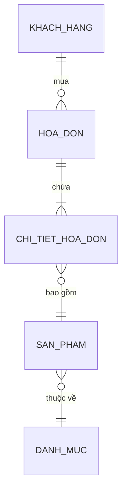

# HƯỚNG DẪN CHI TIẾT VẼ SƠ ĐỒ CONCEPTUAL DATA MODEL (CDM)

## I. KHÁI NIỆM CDM

### 1. CDM là gì?

- **Conceptual Data Model (CDM)** là sơ đồ dữ liệu ở mức độ khái niệm (conceptual level)
- Mô tả cấu trúc và mối quan hệ giữa các thực thể (entity) trong hệ thống
- Độc lập với công nghệ cơ sở dữ liệu cụ thể
- Sử dụng ký hiệu chuẩn như Chen's notation hoặc UML
- Là bước thiết kế đầu tiên trước khi thiết kế logic (LDM) và vật lý (PDM)

### 2. Lợi ích của CDM

- Giúp hiểu rõ yêu cầu dữ liệu của hệ thống
- Dễ giao tiếp với stakeholder không có nền tảng kỹ thuật
- Phát hiện vấn đề sớm trong giai đoạn thiết kế
- Tạo nền tảng vững chắc cho các bước thiết kế tiếp theo
- Giúp đảm bảo không nhất quán dữ liệu

## II. CÁC THÀNH PHẦN CỦA CDM

### 1. Thực Thể (Entity)

**Định nghĩa**: Một đối tượng, sự vật hoặc khái niệm cần lưu trữ thông tin

**Ký hiệu**: Hình chữ nhật

**Ví dụ**:

- KHÁCH HÀNG
- SẢN PHẨM
- HÓA ĐƠN
- NHÂN VIÊN
- PHÒNG BAN

**Nguyên tắc đặt tên**:

- Sử dụng tiếng Việt hoặc tiếng Anh (thống nhất toàn bộ dự án)
- Dùng danh từ số ít (VD: KHÁCH HÀNG, không phải KHÁCH HÀNG S)
- Dùng chữ HOA
- Tên rõ ràng, dễ hiểu
- Không sử dụng ký tự đặc biệt

**Ví dụ tốt vs không tốt**:

```
✓ KHÁCH HÀNG
✗ KH
✗ CÁC KHÁCH HÀNG
✗ Customer_Info
```

### 2. Thuộc Tính (Attribute)

**Định nghĩa**: Một đặc trưng, tính chất của thực thể

**Ký hiệu**: Hình elip với tên thuộc tính bên trong

**Phân loại**:

#### a) Thuộc tính đơn (Simple Attribute)

- Không thể được phân chia thành các thành phần nhỏ hơn
- VD: Tuổi, Chiều cao, Màu sắc

#### b) Thuộc tính phức tạp (Composite Attribute)

- Có thể được phân chia thành các thành phần nhỏ hơn
- VD: ĐỊA CHỈ = ĐƯỜNG + QUẬN + THÀNH PHỐ
- Được vẽ bằng hình elip nhỏ

#### c) Thuộc tính đơn trị (Single-valued Attribute)

- Mỗi thực thể chỉ có một giá trị duy nhất
- VD: Ngày sinh, Email (trong hầu hết trường hợp)

#### d) Thuộc tính đa trị (Multi-valued Attribute)

- Mỗi thực thể có thể có nhiều giá trị
- Ký hiệu: Elip đôi
- VD: SỐ ĐIỆN THOẠI (một khách hàng có thể có nhiều số điện thoại)

#### e) Thuộc tính dẫn xuất (Derived Attribute)

- Được tính toán từ các thuộc tính khác
- Ký hiệu: Elip đứt đoạn
- VD: TUỔI được tính từ NGÀY SINH

#### f) Thuộc tính khóa (Key Attribute)

- Định danh duy nhất cho mỗi thực thể
- Ký hiệu: Gạch dưới hoặc tô đậm
- VD: ID KHÁCH HÀNG, MÃ SẢN PHẨM

**Nguyên tắc đặt tên thuộc tính**:

- Đặt tên rõ ràng, dễ hiểu
- Sử dụng danh từ
- Không sử dụng ký tự đặc biệt
- Thống nhất cách đặt tên (camelCase hoặc UPPER_CASE)

**Ví dụ**:

```
KHÁCH HÀNG
├── Mã khách hàng (Key Attribute)
├── Họ và tên
├── Địa chỉ (Composite)
│   ├── Số nhà
│   ├── Đường
│   └── Thành phố
├── Số điện thoại (Multi-valued)
└── Năm sinh (có thể là Derived từ Ngày sinh)
```

### 3. Mối Quan Hệ (Relationship)

**Định nghĩa**: Liên kết giữa hai hoặc nhiều thực thể

**Ký hiệu**: Hình thoi với tên mối quan hệ

**Phân loại mối quan hệ**:

#### a) Theo số lượng thực thể tham gia:

**Mối quan hệ nhị phân (Binary Relationship)**

- Giữa 2 thực thể
- Phổ biến nhất

**Mối quan hệ ba ngôi (Ternary Relationship)**

- Giữa 3 thực thể

**Mối quan hệ n-ngôi (N-ary Relationship)**

- Giữa n thực thể (n > 2)

#### b) Theo tính chất:

**Mối quan hệ bình thường (Normal)**

- Thực thể tham gia có ý nghĩa độc lập

**Mối quan hệ yếu (Weak)**

- Một thực thể (yếu) phụ thuộc vào thực thể khác (mạnh)
- Thực thể yếu không thể tồn tại nếu thực thể mạnh bị xóa
- Ký hiệu: Mũi tên đôi

**Ví dụ**:

- KHÁCH HÀNG và HÓA ĐƠN: Mối quan hệ yếu (HÓA ĐƠN phụ thuộc vào KHÁCH HÀNG)
- SẢN PHẨM và CHI TIẾT HÓA ĐƠN: Mối quan hệ yếu

### 4. Cardinality (Tính Đa Ngôi)

**Định nghĩa**: Số lượng thực thể từ một tập hợp thực thể tham gia vào mối quan hệ với một thực thể từ tập hợp khác

**Một số (1) : Một số (1)** - One-to-One (1:1)

- Một thực thể A liên kết với đúng một thực thể B và ngược lại
- Ký hiệu: 1 --- [Relationship] --- 1
- VD: NHÂN VIÊN và TÀI KHOẢN NGÂN HÀNG

**Một số (1) : Nhiều số (M)** - One-to-Many (1:M)

- Một thực thể A liên kết với nhiều thực thể B, nhưng một B chỉ liên kết với một A
- Ký hiệu: 1 --- [Relationship] --- M hoặc 1 --- [Relationship] --- \*
- VD: KHÁCH HÀNG và HÓA ĐƠN (1 khách hàng can have nhiều hóa đơn)

**Nhiều số (M) : Nhiều số (N)** - Many-to-Many (M:N)

- Một thực thể A liên kết với nhiều thực thể B, và một B cũng liên kết với nhiều A
- Ký hiệu: M --- [Relationship] --- N hoặc _ --- [Relationship] --- _
- VD: SẢN PHẨM và HÓA ĐƠN qua CHI TIẾT HÓA ĐƠN

**Bảng tóm tắt Cardinality**:

```
┌─────────────────┬──────────────┬────────────────────┐
│ Cardinality     │ Ký hiệu      │ Ý nghĩa            │
├─────────────────┼──────────────┼────────────────────┤
│ 1:1             │ 1 --- 1      │ Một với một        │
│ 1:M             │ 1 --- M      │ Một với nhiều       │
│ M:N             │ M --- N      │ Nhiều với nhiều    │
│ 0..1            │ 0..1         │ Không hoặc một     │
│ 1..M            │ 1..M         │ Một hoặc nhiều     │
├─────────────────┴──────────────┴────────────────────┤
│ 0..M, *, M, N: Có thể không hoặc nhiều              │
└─────────────────────────────────────────────────────┘
```

### 5. Constraint (Ràng Buộc)

**Định nghĩa**: Quy tắc giới hạn giá trị hoặc mối quan hệ

**Các loại ràng buộc**:

#### a) Ràng buộc khóa chính (Primary Key)

- Xác định duy nhất mỗi bản ghi
- Không được phép NULL
- Không được phép trùng lặp

#### b) Ràng buộc khóa ngoài (Foreign Key)

- Liên kết dữ liệu giữa các bảng
- Giá trị phải tồn tại trong bảng được tham chiếu

#### c) Ràng buộc NULL/NOT NULL

- NULL: Cho phép để trống
- NOT NULL: Bắt buộc phải có giá trị

#### d) Ràng buộc duy nhất (Unique)

- Không cho phép trùng lặp giá trị
- Cho phép NULL

#### e) Ràng buộc kiểm tra (Check)

- Kiểm tra giá trị có thỏa điều kiện cho trước
- VD: Tuổi >= 18, Giá > 0

## III. HƯỚNG DẪN TỪNG BƯỚC VẼ CDM

### Bước 1: Phân tích yêu cầu

- Đọc kỹ tài liệu yêu cầu hệ thống
- Xác định các tiến trình, hoạt động chính
- Xác định thông tin cần lưu trữ
- Xác định các tác nhân (người dùng) trong hệ thống

### Bước 2: Xác định các thực thể chính

- Liệt kê tất cả các đối tượng, sự vật trong hệ thống
- Mỗi đối tượng là một ứng cử viên cho thực thể
- Loại bỏ những thứ không cần thiết
- Tập trung vào các thực thể quan trọng trước, chi tiết sau

**Ví dụ cho hệ thống bán hàng**:

- KHÁCH HÀNG
- SẢN PHẨM
- HÓA ĐƠN
- NHÂN VIÊN
- PHÒNG BAN
- DANH MỤC SẢN PHẨM

### Bước 3: Xác định thuộc tính cho mỗi thực thể

- Liệt kê tất cả thông tin liên quan đến mỗi thực thể
- Xác định loại thuộc tính (đơn, phức, đơn trị, đa trị, dẫn xuất)
- Xác định khóa chính (primary key)
- Xác định các ràng buộc

**Ví dụ KHÁCH HÀNG**:

```
KHÁCH HÀNG
├── ID Khách hàng (Key)
├── Họ và tên
├── Ngày sinh
├── Địa chỉ (Composite: Số nhà, Đường, Phường, Quận, Thành phố, Mã bưu điện)
├── Email
├── Số điện thoại (Multi-valued)
├── Tuổi (Derived từ Ngày sinh)
├── Giới tính
├── Ngày đăng ký
└── Trạng thái (Hoạt động, Tạm dừng, Bị khóa)
```

### Bước 4: Xác định mối quan hệ giữa các thực thể

- Tìm các liên kết ngữ nghĩa giữa thực thể
- Đặt tên rõ ràng cho mối quan hệ
- Xác định cardinality (1:1, 1:M, M:N)
- Xác định thực thể tham gia bắt buộc hay tùy chọn

**Nguyên tắc tìm mối quan hệ**:

- Hỏi: "A có thể có nhiều B?" - Nếu có: 1 A có M B
- Hỏi: "B có thể thuộc về nhiều A?" - Nếu có: M B có 1 A
- Hỏi: "Cả hai câu hỏi trên đều là Có?" - Mối quan hệ M:N

**Ví dụ**:

- KHÁCH HÀNG (1) --- Mua --- (M) HÓA ĐƠN
- HÓA ĐƠN (M) --- Chứa --- (M) SẢN PHẨM
- PHÒNG BAN (1) --- Quản lý --- (M) NHÂN VIÊN

### Bước 5: Xác định Participation (Tham gia)

**Tham gia toàn phần (Total Participation)**

- Mỗi thực thể phải tham gia vào mối quan hệ
- Ký hiệu: Gạch dâu đôi
- VD: Mỗi HÓA ĐƠN phải thuộc về KHÁCH HÀNG

**Tham gia bộ phận (Partial Participation)**

- Một số thực thể tham gia vào mối quan hệ
- Ký hiệu: Gạch đơn
- VD: Không phải KHÁCH HÀNG nào cũng có HÓA ĐƠN

```
Toàn phần:   ═══╪════
Bộ phận:     ───╪────
```

### Bước 6: Kiểm tra và tinh chỉnh

- Kiểm tra mỗi thực thể có đủ thông tin không
- Kiểm tra mối quan hệ có logic không
- Loại bỏ thực thể dư thừa
- Hợp nhất thực thể có khả năng là cùng một thứ
- Xác nhận với stakeholder

## IV. QUI TẮC THIẾT KẾ CDM

### 1. Nguyên tắc chuẩn hóa dữ liệu

**Tránh các vấn đề**:

- Không để dữ liệu lặp lại (Redundancy)
- Không để mất dữ liệu (Data Loss)
- Không để dữ liệu không nhất quán (Inconsistency)

**Cách làm**:

- Mỗi thực thể nên tập trung vào một khái niệm
- Tránh tính toán lặp lại thông tin
- Sử dụng mối quan hệ để liên kết dữ liệu

### 2. Nguyên tắc đặt tên

- **Thực thể**: Danh từ số ít, tính từ + danh từ hoặc danh từ ghép

    ```
    ✓ KHÁCH HÀNG, NHÂN VIÊN, HÓA ĐƠN
    ✗ KH, KHÁCH, KHÁCH HÀNG CÓ
    ```

- **Thuộc tính**: Danh từ rõ ràng

    ```
    ✓ Tên khách hàng, Ngày tạo, Trạng thái
    ✗ Name, T, Status Code 123
    ```

- **Mối quan hệ**: Động từ hoặc cụm động từ (hành động, mối liên hệ)
    ```
    ✓ Mua, Chứa, Quản lý, Thuộc về, Có
    ✗ R1, Rel, Association
    ```

### 3. Nguyên tắc khóa

- Mỗi thực thể phải có ít nhất một khóa chính
- Khóa chính nên là duy nhất, không thay đổi
- Ưu tiên khóa nhân tạo (Surrogate key) hơn khóa tự nhiên (Natural key)
- Khóa ngoài kết nối các bảng với nhau

### 4. Nguyên tắc mối quan hệ

- Nên có ít nhất một mối quan hệ giữa hai thực thể có dữ liệu liên quan
- Tránh mối quan hệ vòng tròn không cần thiết
- Nên có ít mối quan hệ N:M (cân nhắc bảng kết hợp)

### 5. Nguyên tắc không chuẩn hóa (Denormalization)

Đôi khi cần không chuẩn hóa để:

- Cải thiện hiệu năng truy vấn
- Giảm độ phức tạp
- Giảm số lần JOIN

Nhưng cần cân nhắc kỹ và có lý do chính đáng.

## V. VÍ DỤ THỰC TIỄN

### Ví dụ 1: Hệ Thống Quản Lý Bán Hàng

```
┌──────────────────────────────────────────────────────────────┐
│                        CDM Bán Hàng                          │
└──────────────────────────────────────────────────────────────┘

                    ┌────────────────┐
                    │   KHÁCH HÀNG   │
                    ├────────────────┤
                    │ • ID (PK)      │
                    │ • Tên          │
                    │ • Địa chỉ      │
                    │ • Số ĐT        │
                    │ • Email        │
                    └────────┬───────┘
                             │ (1,M)
                             │ Mua
                             │
                    ┌────────▼───────┐
                    │    HÓA ĐƠN     │
                    ├────────────────┤
                    │ • ID (PK)      │
                    │ • Ngày         │
                    │ • Tổng tiền    │
                    │ • Trạng thái   │
                    │ • FK_KH (FK)   │
                    └────┬───────┬───┘
                         │       │ (M,N)
                         │       │ Chứa
                         │       │
              ┌──────────▼──┐   ┌▼──────────┐
              │ CHI TIẾT HĐ │   │ SẢN PHẨM  │
              ├─────────────┤   ├───────────┤
              │ • ID (PK)   │   │ • ID(PK)  │
              │ • SL        │   │ • Tên     │
              │ • Đơn giá   │   │ • Giá     │
              │ • FK_HĐ(FK) │   │ • Mô tả   │
              │ • FK_SP(FK) │   │ • FK_DM   │
              └─────────────┘   └───────────┘
                                       △
                                       │ (1,M)
                                       │ Thuộc
                                       │
                        ┌──────────────┴──────┐
                        │  DANH MỤC SẢN PHẨM │
                        ├───────────────────┤
                        │ • ID (PK)         │
                        │ • Tên             │
                        │ • Mô tả           │
                        └───────────────────┘
```

### Ví dụ 2: Hệ Thống Quản Lý Nhân Sự

```
                    ┌─────────────────┐
                    │    PHÒNG BAN    │
                    ├─────────────────┤
                    │ • ID (PK)       │
                    │ • Tên           │
                    │ • Số điện thoại │
                    │ • Trụ sở        │
                    └────────┬────────┘
                             │ (1,M)
                             │ Quản lý
                             │
                    ┌────────▼────────┐
                    │     NHÂN VIÊN   │
                    ├─────────────────┤
                    │ • ID (PK)       │
                    │ • Tên           │
                    │ • Ngày sinh     │
                    │ • Email         │
                    │ • Chức vụ       │
                    │ • FK_PB (FK)    │
                    └────────┬────────┘
                             │ (1,M)
                             │ Có
                             │
                    ┌────────▼────────┐
                    │    HÓNG HỎC     │
                    ├─────────────────┤
                    │ • ID (PK)       │
                    │ • Tên           │
                    │ • Ngày khóa học │
                    │ • Cơ sở         │
                    │ • FK_NV (FK)    │
                    └─────────────────┘
```

## VI. NHỮNG LỖI THƯỜNG GẶP KHI VẼ CDM

### 1. Lỗi về Thực Thể

- ✗ Sử dụng động từ làm tên thực thể
- ✗ Thực thể không có khóa chính
- ✗ Thực thể có quá nhiều thuộc tính không liên quan
- ✗ Thực thể dư thừa (có thể hợp nhất)

### 2. Lỗi về Thuộc Tính

- ✗ Lưu các giá trị có thể tính toán được
- ✗ Sử dụng mã hoặc chữ viết tắt chưa được định nghĩa
- ✗ Để các giá trị NULL khi có thể sử dụng Composite Attribute
- ✗ Không xác định rõ kiểu dữ liệu

### 3. Lỗi về Mối Quan Hệ

- ✗ Mối quan hệ không có tên hoặc tên không rõ
- ✗ Cardinality không chính xác
- ✗ Mối quan hệ vòng tròn không cần thiết
- ✗ Quên mối quan hệ M:N (cho phép nhiều khả năng liên kết)

### 4. Lỗi về Thiết Kế Tổng Thể

- ✗ Thiết kế không đáp ứng tất cả yêu cầu
- ✗ Thiết kế quá phức tạp
- ✗ Thiết kế không nhất quán (sử dụng các quy ước khác nhau)
- ✗ Không xác nhận với stakeholder

## VII. CÔNG CỤ VẼ CDM

### 1. Công cụ miễn phí

- **Lucidchart**: https://www.lucidchart.com (có trial)
- **Draw.io/Diagrams.net**: https://www.draw.io (miễn phí)
- **yEd**: https://www.yworks.com/products/yed (miễn phí)
- **Tinkerpop**: https://tinkerpop.apache.org

### 2. Công cụ chuyên nghiệp

- **Visio** (Microsoft): Hỗ trợ template CDM
- **PowerDesigner** (SAP): Công cụ chuyên dụng cho thiết kế CSDL
- **Erwin Data Modeler**: Công cụ hàng đầu cho mô hình dữ liệu
- **Navicat**: Hỗ trợ tạo ERD/CDM
- **MySQL Workbench**: Miễn phí, hỗ trợ Forward/Reverse Engineering

### 3. Sử dụng Markdown/Mermaid



## VIII. CHECKLIST VẼ CDM

- [ ] Tất cả thực thể đã được xác định
- [ ] Mỗi thực thể có ít nhất một khóa chính
- [ ] Tất cả thuộc tính quan trọng được xác định
- [ ] Các thuộc tính được phân loại đúng (đơn/phức, đơn trị/đa trị)
- [ ] Tất cả mối quan hệ được xác định
- [ ] Cardinality chính xác cho mỗi mối quan hệ
- [ ] Participation (toàn phần/bộ phận) được xác định
- [ ] Không có thực thể dư thừa hoặc trùng lặp
- [ ] Không có mối quan hệ vòng tròn không cần thiết
- [ ] Đặt tên thống nhất (Tiếng Việt hoặc Tiếng Anh, không trộn lẫn)
- [ ] Không có dữ liệu lặp lại (No Redundancy)
- [ ] Có thể đáp ứng tất cả yêu cầu của hệ thống
- [ ] CDM được xác nhận giữa các stakeholder

## IX. TIP VÀ TRICK

### 1. Khi nào sử dụng Bảng Kết Hợp (Junction Table)?

- Khi có mối quan hệ M:N
- Khi mối quan hệ M:N có thuộc tính riêng
- VD: SẢN PHẨM và HÓA ĐƠN → CHI TIẾT HÓA ĐƠN

### 2. Khi nào sử dụng Khóa Nhân Tạo (Surrogate Key)?

- Khi khóa tự nhiên quá dài
- Khi cần tối ưu hiệu năng
- Khi khóa tự nhiên có thể thay đổi

### 3. Sử dụng Entity Supertypes và Subtypes

- Khi có thực thể chung và các thực thể chuyên biệt
- VD: NHÂN VIÊN (cha) → NHÂN VIÊN HÀNH CHÍNH, NHÂN VIÊN KINH DOANH (con)
- Giúp giảm lặp lại thuộc tính chung

### 4. Đặt tên Mối Quan Hệ từ cả hai hướng

- Từ A → B: "Mua"
- Từ B → A: "Được mua bởi"
- Giúp hiểu rõ hơn

## X. THAM KHẢO

- Chen, P. P. (1976). "The Entity-Relationship Model—Toward a Unified View of Data" - Tài liệu gốc về ERD
- ISO/IEC/IEEE 42010 - Kiến trúc và mô tả hệ thống
- Tài liệu Modeling của các DBMS: Oracle, MySQL, PostgreSQL, SQL Server
- UML Specification - Mô hình UML bao gồm Class Diagram (tương tự CDM)

---

**Lưu ý**: CDM là nền tảng quan trọng của process thiết kế cơ sở dữ liệu. Đầu tư thời gian vào CDM sẽ giảm thiểu lỗi ở các bước tiếp theo (LDM, PDM) và tiết kiệm chi phí sửa chữa sau này.
